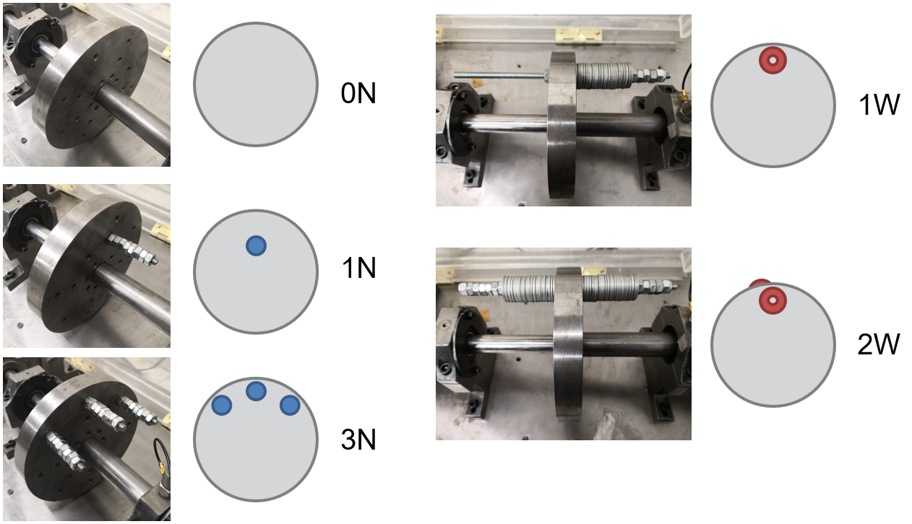

# Shaft Unbalance Education Dataset

This dataset contains accelerometer data (in the vertical, parallel to gravity direction) for an induction motor shaft subjected to different induced levels of unbalance. This dataset is offered by *Universidad de los Andes* and *Politecnico di Milano* as part of the research paper:

Barbieri G, Sanchez-Londono D, Cattaneo L, Fumagalli L, Romero D. A Case Study for Problem-based Learning Education in Fault Diagnosis Assessment. IFAC-PapersOnLine. 2020 Jan 1;53(3):107-12. ([Paper ResearchGate Link](
https://www.researchgate.net/publication/341220476_A_Case_Study_for_Problem-based_Learning_Education_in_Fault_Diagnosis_Assessment]))

The dataset may be freely used by citing the above paper as per scientific community conventions.

## Original and subdivided files

The data files are provided in two forms. The *txt_original* folder contains the data as it was captured: 4 runs per unbalance mode. The *txt_divided* contains this same data further divided, each measurement run separated into 5 files for a total of 20 files per unbalance mode. These latter files were the ones used in the above research paper.

## Folder names

In either of the two folders there are 5 different subfolders, each containing text files for 5 shaft unbalance conditions, as so:

*unbalance_X_ZZ*

Where *X* is an integer from 0 to 4, indicating the 5 studied unbalance cases in order of increasing severity, and *ZZ* is the identifier that the paper uses to refer to said unbalance condition:

(Taken from the research paper)

## File format and conversion factor

Each file contains multiple measured samples, with each line belonging to one sample and containing one timestamp (in seconds) and one measured value (in Volt). To convert the measured value to m/s2, the following conversion factor must be considered:

1 m/s2 (meters per second squared) = 9.89 mV (milliVolt)

So, for example, a value of -0.003504 V in the text file would be equal to -0.003504/(9.89/1000) = -0.354297 m/s2

## Utilized devices

Induction motor: [WEG Multimounting High Efficiency 0.5 HP 13958126](https://www.weg.net/catalog/weg/US/en/Electric-Motors/AC-Motors---IEC/General-Purpose/Aluminum-Frame/Multimounting-High-Efficiency-0-5-HP-4P-71-3Ph-230-460-380-415-V-60-Hz-IC411---TEFC---B3L%28E%29/p/13958126) 
Accelerometer: [Bruel Kjaer 4396](https://www.bksv.com/media/doc/bp1288.pdf)
